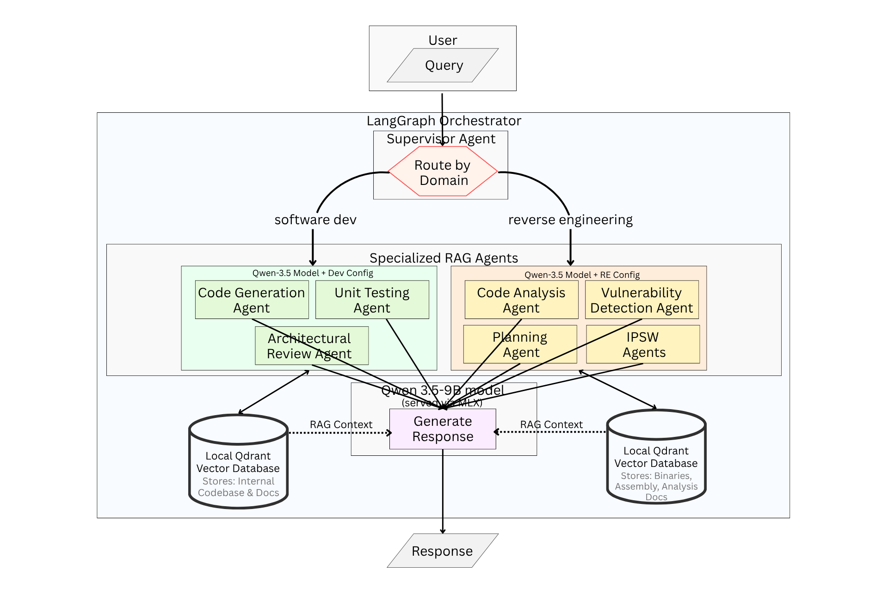
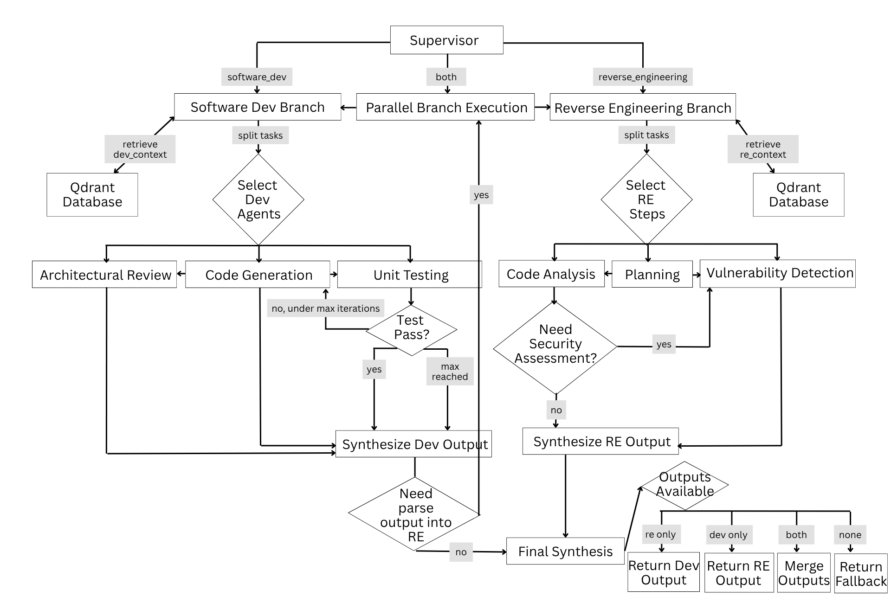
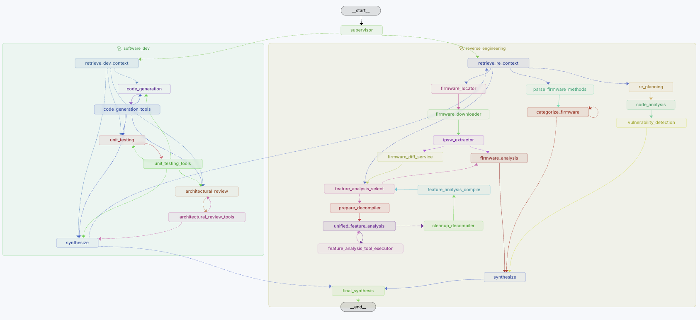

# Local Multi-Agent Development System

Local-first, LangGraph-based orchestration for two domains: software development and reverse engineering. A supervisor routes requests to one or both branches and returns a unified result.

## What This Repository Provides
- Domain routing with optional dual-branch execution
- Software development workflow: code generation, testing loop, architecture review
- Reverse engineering workflow: firmware diffing, feature analysis, IDA Pro binary decompilation
- FastAPI service for local use and LangSmith Studio integration
- MLX-based local inference on Apple Silicon (Qwen3.5-9B-4bit)
- Embedded Qdrant retrieval with Qwen embeddings

## Tech Stack

| Component | Technology |
|---|---|
| Model | Qwen3.5-9B-4bit |
| Orchestration | LangGraph |
| LLM inference | MLX + MLX-LM |
| State management | Pydantic |
| Vector database | Qdrant (embedded) |
| Embeddings | Qwen3 Embeddings |
| Binary analysis | IDA Pro 9.1 (headless, via RPyC RPC) |
| Firmware tooling | `ipsw` CLI |
| API server | FastAPI |
| Runtime | Python 3.11+ |
| Testing / CI | pytest + ruff · GitHub Actions |

## Architecture

### System Architecture


### High-Level Flow


### LangGraph Flow


---

## IPSW Firmware Analysis Pipeline

The reverse engineering domain includes a dedicated, stage-gated firmware analysis pipeline powered by the `ipsw` CLI and a headless IDA Pro 9.1 RPC server.

### Pipeline Stages

| Stage | Node | What it does |
|---|---|---|
| 1 | `firmware_locator` | Resolves device identifiers and build numbers |
| 2 | `firmware_downloader` | Downloads IPSW/OTA artifacts |
| 3 | `ipsw_extractor` | Extracts `dyld_shared_cache` and `kernelcache` |
| 4 | `firmware_diff_service` | Diffs old vs new firmware; writes structured `report.json` |
| 5 | `feature_analysis_select` → `prepare_decompiler` → `unified_feature_analysis` | LLM-driven per-component analysis with IDA decompilation |
| 6 | `cleanup_decompiler` | Saves IDA database (`.i64`) then shuts down IDA |
| 7 | `feature_analysis_compile` | Writes per-component markdown reports |
| 8 | `synthesize` | Aggregates all findings into a final report |

### Firmware Diff Service (`ipsw_service/`)

`FirmwareDiffService` generates a structured diff JSON and orchestrates all analysis steps:

- Runs `ipsw diff` to detect changes in Mach-O binaries, entitlements, launchd plists, sandbox profiles, and kernel extensions.
- Runs `ipsw dyld info --dylibs --diff` on `dyld_shared_cache_arm64e` pairs to capture DSC framework changes not covered by standard diffs.
- Classifies results by origin: filesystem binaries → `macho`, shared cache binaries → `dsc`.
- Applies `IGNORE_PATTERNS` to exclude non-analyzable artifacts (e.g. Metal shaders, microcode).
- Suppresses metadata-only diffs (e.g. UUID, `LC_*`, `__LINKEDIT`) to reduce noise.

**Artifact layout for a run (e.g. `20260705-095834`, iOS 26.4.1 → 26.4.2):**
```
artifacts/firmware_diff/20260705-095834/
├── report.json                        ← structured diff payload (fed to LLM)
├── artifacts/
│   ├── dyld_diff.txt                  ← raw ipsw dyld diff output + parsed items
│   ├── kernel_diff.txt
│   ├── launchd_diff.txt
│   ├── kext_diff.txt
│   └── sandbox_diff.txt
├── diff/26_4_1_23E254_vs_26_4_2_23E261/
│   └── README.md                      ← raw ipsw diff markdown (30KB+, not fed to LLM)
├── entitlements/
│   └── entitlements.idiff
└── feature_analysis/
    ├── 00_SUMMARY.md                  ← security-tiered summary of all analyzed components
    ├── iMessage_analysis.md
    ├── IMSharedUtilities_analysis.md
    └── <component>_analysis.md        ← one file per analyzed component
```

> **Note:** `report.json` (typically ~11KB) is what gets injected into the LLM's context for feature analysis. The raw `README.md` from `ipsw diff` (~30KB+) is intentionally excluded to avoid GPU OOM on local MLX inference.

### `report.json` Schema

```json
{
  "summary_metrics": { "total_cstring_changes": 74 },
  "kernel": {
    "kexts": ["..."],
    "firmware": ["..."]
  },
  "macho": {
    "updated": ["..."]
  },
  "dsc": {
    "dylibs": {
      "updated": ["..."]
    }
  },
  "feature_flags": [],
  "boundary_changes": {
    "entitlements": [],
    "sandbox": [],
    "launchd": ["..."]
  },
  "cstring_context": [
    "ComponentName: + \"<added_string>\"",
    "ComponentName: - \"<removed_string>\""
  ]
}
```

### IDA Pro Integration

The feature analysis pipeline connects to IDA Pro 9.1 via a headless RPyC RPC server (`langgraph_orchestration/tooling/ida_rpc_server.py`).

**How it works:**
1. `prepare_decompiler_node` extracts the target binary from the DSC using `ipsw dyld extract` into a per-comparison folder under `.ipsw_features/` (named for the firmware diff, e.g. `.ipsw_features/iPhone17,1__18_4_22E240_vs_18_4_1_22E252/`).
2. IDA is launched headlessly: `idat -A -c -S<rpc_server.py> <binary>`.
3. The LLM calls IDA tools during feature analysis: `find_address`, `get_xrefs_to`, `decompile_function`, `rename_local_variable`, `set_comment`.
4. `cleanup_decompiler_node` **always** calls `save_ida_database` before stopping IDA, guaranteeing the `.i64` is written regardless of LLM behaviour.

**IDA database files:**
```
.ipsw_features/
└── iPhone18,1__26_4_1_23E254_vs_26_4_2_23E261/   ← one folder per firmware comparison
    ├── IMSharedUtilities       ← extracted Mach-O binary (from the NEW build)
    ├── IMSharedUtilities.i64   ← saved IDA database (written by cleanup_decompiler_node)
    ├── AppPredictionClient
    ├── AppPredictionClient.i64
    └── ...
```

The folder name is derived from the diff pair by `_comparison_dirname`, matching the
`artifacts/firmware_diff/.../diff/<old>_vs_<new>` naming so the two cross-reference.

> **Important:** If a `.i64` already exists for a binary, `start_ida_server_for_binary` will reload it (preserving prior annotations) instead of creating a fresh database. Only the unpacked working files (`.id0/.id1/.nam/.til`) from aborted runs are cleaned up on restart.

**Required `.env` variables for IDA integration:**
```
IDA_PATH=/Applications/IDA Professional 9.1.app/Contents/MacOS/idat
IDA_RPC_SCRIPT_PATH=/path/to/repo/langgraph_orchestration/tooling/ida_rpc_server.py
```

IDA listens on `localhost:18861`. The client uses a 360-second RPC timeout (larger than the server-side 300-second main-thread timeout).

### DSC Binary Extraction

The `prepare_decompiler_node` uses the following extraction strategy (in priority order):

1. **Pre-extracted binary** - checks this comparison's `.ipsw_features/<comparison>/` folder for an already-extracted Mach-O.
2. **DSC extraction** - `ipsw dyld extract <dsc_path> <binary_path> -o .ipsw_features/<comparison>/` (fastest, no DMG mount).
3. **Existing DMG mount** - scans `/private/tmp/*.mount` for binaries left by `ipsw diff`.
4. **IPSW archive extraction** - `ipsw extract <ipsw> --files --pattern <name>` (fallback for daemons and apps not in the DSC).

### Feature Analysis Targets

The pipeline does not analyze every changed binary. `_build_feature_targets` filters the diff report down to **high-signal components**, i.e. those that carry meaningful cstring or symbol evidence. Only these are queued for IDA-assisted decompilation.

Each feature analysis report (`<component>_analysis.md`) follows this structure:
```
## What this feature does
## How is it implemented      ← includes decompiled pseudocode and call chains
## How to trigger this feature
## Evidence                   ← addresses, symbols, strings, decompiled excerpts
## AI Prioritisation Scoring System
```

---

## Benchmark Harnesses

| Script | What it does | Output |
|---|---|---|
| `benchmarks/test_ipsw_diff.py` | Full pipeline: firmware diff → feature analysis end to end | `benchmarks/results/test_ipsw_diff/` |
| `benchmarks/test_feature_analysis.py` | Feature analysis only against an existing `report.json` (skips diff stage) | `benchmarks/results/test_feature_analysis/` |

### `test_ipsw_diff.py` - internals

1. Builds an `IpswDiffCase` for a fixed pair of IPSWs.
2. Runs `build_orchestration_graph` → invokes the full pipeline.
3. On completion, calls `trigger_feature_analysis` on the generated `report.json`.

`trigger_feature_analysis` searches up to 3 directory levels from the README path to locate `report.json`. It feeds `report.json` (not the raw diff markdown) to the LLM. See the [context size note](#firmware-diff-service-ipsw_service).

### `test_feature_analysis.py` - internals

Seeds `firmware_diff_report` directly in state, so the graph routes straight to `feature_analysis_select_node` (the firmware diff stage is skipped entirely).

- Edit `REPORT_PATH` at the top of the file to point at your diff artifacts.
- Pre-filters the report to dylib-relevant sections before injecting into state.

---

## Quickstart

Create a virtual environment and install dependencies:
```bash
python3 -m venv venv
source venv/bin/activate
python3 -m pip install --upgrade pip
python3 -m pip install -r requirements.txt
python3 -m pip install -r requirements-dev.txt   # pytest, ruff, pip-audit
```

Copy and fill in environment variables:
```bash
cp .env.example .env
# Edit .env: set IDA_PATH, IDA_RPC_SCRIPT_PATH, and optionally LANGSMITH_API_KEY
```

Run the example script:
```bash
python3 examples.py
```

API default address: `http://localhost:8000` (`API_HOST` and `API_PORT` are configurable via `.env`)

---

## How To Communicate With The Model

All three interfaces route through a single shared entry point: `OrchestrationRuntime`.

| Interface | Entry point | Details |
|---|---|---|
| **Gradio chat** | `python3 app.py` | [Gradio chat section](#gradio-chat-apppy) |
| **FastAPI** | `python3 api.py` | [FastAPI section](#fastapi-service-apipy). Use `curl` or any HTTP client |
| **Python** | `get_runtime().run(...)` | Direct graph invocation (see below) |

### Direct Python graph invocation

```python
from langgraph_orchestration.runtime import get_runtime

# Returns an AgentState; the runtime builds and caches the graph on first use
final_state = get_runtime().run(
    "Generate a Python sorting function and assess security risks"
)

print(final_state.selected_domain)
print(final_state.agent_chain)
print(final_state.final_output)
```

---

### FastAPI service (`api.py`)

Local-only, no request authentication. **Refuses to start unless `API_HOST` is a
loopback address.** Endpoints marked ★ execute code, spawn processes, or mutate durable state.

```bash
python3 api.py

curl -X POST http://127.0.0.1:8000/invoke \
  -H "Content-Type: application/json" \
  -d '{"user_input":"Implement an API auth flow and inspect it for vulnerabilities"}'
```

#### Endpoints

| Group | Endpoint | Purpose |
|---|---|---|
| **Core** | `GET /` | Health check |
| | `GET /info` | Service metadata and configured agents |
| | `GET /domains` | Available domains and descriptions |
| | `POST /invoke` ★ | Run orchestration (`user_input`, optional `domain`) |
| **RAG** | `POST /rag/add` ★ | Add a document to the vector DB |
| | `POST /rag/search` ★ | Semantic search |
| | `GET /rag/stats` | Collection statistics |
| **LangSmith** | `GET /assistants` | Assistants list |
| | `POST /assistants/search` | Search assistants |
| | `GET /assistants/{id}` | Assistant details |
| | `GET /assistants/{id}/schemas` | Input/output schemas |
| | `GET /graph` | Graph nodes and edges |
| | `GET /graph/schema` | Runnable schema |
| | `POST /langgraph` ★ | LangSmith Studio invocation |
| | `GET /test-graph` | Registration check |
| **Threads** | `GET /threads` | List threads (placeholder) |
| | `POST /threads/{id}/messages` ★ | Send a message |

Example response from `POST /invoke`:
```json
{
  "selected_domain": "software_dev",
  "agent_chain": ["retrieve_dev_context", "code_generation", "unit_testing"],
  "final_output": "...",
  "intermediate_outputs": ["..."]
}
```

| Variable | Default | Purpose |
|---|---|---|
| `API_HOST` | `127.0.0.1` | Bind address; must be loopback |
| `API_PORT` | `8000` | Bind port |
| `API_RELOAD` | `false` | Uvicorn auto-reload (dev only) |

---

## Embedding Models And Retrieval

All collections use [Qwen3-Embedding-0.6B](https://huggingface.co/Qwen/Qwen3-Embedding-0.6B) for both ingestion and runtime queries.

Qdrant storage layout (embedded local DB):
```text
~/.local/share/qdrant/
├── agents_software_dev       (code retrieval)
├── agents_reverse_engineering (RE)
└── agents_shared             (general docs)
```

### Ingesting Documents

Use the helper script in `scripts/`:
- `scripts/load_documents_to_qdrant.py` - load `.md`, `.markdown`, `.txt`, or `.jsonl` files into a collection.

Chunking behaviour (defaults):
- Markdown-aware chunking: splits on headers and groups content into chunks.
- Word chunking: used for plain text files.
- JSONL ingestion: each line is treated as a pre-chunked record with `text` and optional `metadata`.

```bash
python scripts/load_documents_to_qdrant.py --file README.md --domain shared
python scripts/load_documents_to_qdrant.py --dir ./docs --domain software_dev --chunk-size 512 --overlap 100
python scripts/load_documents_to_qdrant.py --file chunks.jsonl --domain shared
```

What gets stored:
- Each chunk is embedded and written to the domain collection (`agents_<domain>`).
- Default metadata fields: `source_file`, `chunk_index`, `total_chunks`, `file_type`.
- JSONL chunks can carry custom metadata per line.
- Insertion is batched (default `batch_size=32`).

---

## Configuration Notes

- Inference uses MLX/MLX-LM and expects a compatible local model on Apple Silicon.
- LangSmith tracing is enabled when `LANGSMITH_TRACING=true`.
- If you see `Model type qwen3_5 not supported`, upgrade `mlx-lm` or select a model supported by your current runtime.
- The firmware pipeline requires `ipsw` to be installed and on `PATH` (`brew install blacktop/tap/ipsw`).
- IDA Pro integration requires IDA 9.1+ with Hex-Rays decompiler and a valid license. The RPC server uses `rpyc` (install with `pip install rpyc`).
- GPU OOM during MLX inference: see the [`report.json` note](#firmware-diff-service-ipsw_service) on context size limits.

## Dev And Benchmarks

```bash
pip install -r requirements-dev.txt

# Unit tests
pytest

# Syntax check
python3 -m compileall langgraph_orchestration api.py

# Full pipeline benchmark (firmware diff + feature analysis)
python3 benchmarks/test_ipsw_diff.py

# Feature analysis only (requires existing diff artifacts)
python3 benchmarks/test_feature_analysis.py

# No-RAG benchmark
python3 benchmarks/test_no_rag.py
```

CI (`.github/workflows/ci.yml`) runs on every push to `main`/`langgraph` and every PR: `pip check`, package compile, `ruff check tests/`, `pytest`, and a non-blocking `pip-audit` scan.

LangGraph local dev server with tracing UI:
1. Create a LangSmith account and generate an API key.
2. Set tracing env vars in `.env`:
   - `LANGSMITH_API_KEY=<your_key>`
   - `LANGSMITH_TRACING=true`
   - `LANGSMITH_PROJECT=local-multi-agent-dev`
3. Stop other local API servers first.
4. Start dev server from repo root: `langgraph dev`
5. Open the local LangGraph Studio URL printed in terminal.

---

## References
- LangGraph: https://langchain-ai.github.io/langgraph/
- ipsw CLI: https://blacktop.github.io/ipsw/
- IDA Pro: https://hex-rays.com/ida-pro/
- RPyC: https://rpyc.readthedocs.io/
- Pydantic: https://docs.pydantic.dev/
- Qdrant: https://qdrant.tech/documentation/
- Qwen3 Embeddings: https://huggingface.co/Qwen/Qwen3-Embedding-0.6B
- MLX: https://ml-explore.github.io/mlx/
- FastAPI: https://fastapi.tiangolo.com/

Last updated: July 2026